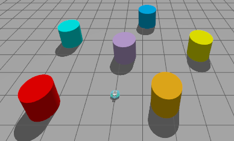
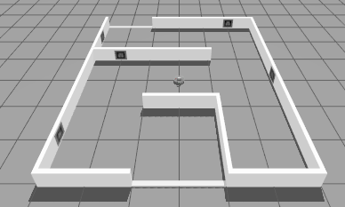

# robotont_gazebo

 [](https://github.com/robotont/robotont_nuc_description/actions/workflows/industrial_ci_action.yml) 

## **Overview**
Gazebo simulation for Robotont.
## **Table of Contents**
- [Installation](#installation)
- [Dependencies](#dependencies)
- [Building the Package](#building-the-package)
- [Launch Files](#launch-files)
- [License](#license)

---

## **Installation**

### **1. Clone the Repository**
```bash
cd ~/<YOUR_WORKSPACE_NAME_HERE>/src
git clone https://github.com/robotont/robotont_gazebo.git
```

## **Dependencies**
### **1. List of dependencies**
1.1. robotont_description<br>
1.2. robotont_nuc_description<br>
1.3. gz_planar_move
### **2. Install dependencies**
```bash
cd ~/<YOUR_WORKSPACE_NAME_HERE>
rosdep install --from-paths src --ignore-src -r -y
```

## **Building the package**
```bash
cd ~/<YOUR_WORKSPACE_NAME_HERE>
colcon build --packages-select robotont_nuc_description
```

## **Launch files**
### **1. Source workspace**
```bash
source ~/<YOUR_WORKSPACE_NAME_HERE>/install/setup.bash
```
### **2. Available launch files**
Supported parameters:

| Name          | Description                                                   | Options                                                                                                                |
|---------------|---------------------------------------------------------------|------------------------------------------------------------------------------------------------------------------------|
| `generation`  | Specify the generation of robotont model that is to be loaded | 2.1, 3 (default)                                                                                                       |
| `model`       | Specify the model that is to be loaded into the world         | robotont_gazebo_basic, robotont_gazebo_nuc (default)                                                                   |
| `world`       | Specify world the robot is spawned in                         | bangbang.sdf, between.sdf, colors.sdf, mapping.sdf, maze.sdf, minimaze.sdf, minimaze_ar.sdf, empty_world.sdf (default) |
| `x`, `y`, `z` | Specify the robot's spawn pose                                | Number, 0 (default)                                                                                                    |
#### 2.1. Gazebo launch
Spawns robot in the specified world
```bash
#### Load generation 3 model in colors.sdf world at pose (-2, 1, 0)
ros2 launch robotont_gazebo gazebo.launch.py world:=colors.sdf x:=-2 y:=1
```


```bash
#### Load generation 2.1 model in minimaze_ar.sdf world
ros2 launch robotont_gazebo gazebo.launch.py world:=minimaze_ar.sdf generation:=2.1
```


## **License**
This project is licensed under the Apache 2.0 license - see the [LICENSE](LICENSE) file for more information.
